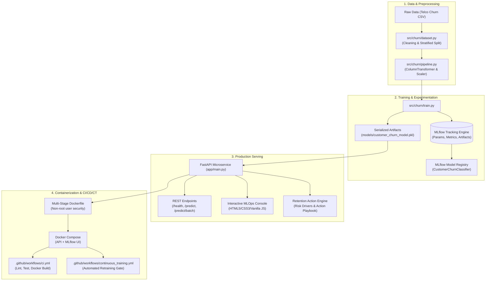

# 🚀 End-to-End Customer Churn MLOps Platform

[](https://www.python.org/)
[](https://fastapi.tiangolo.com/)
[](https://mlflow.org/)
[](https://www.docker.com/)
[](https://github.com/features/actions)
[](https://docs.pytest.org/)

An enterprise-ready, end-to-end Machine Learning Operations (MLOps) platform predicting customer churn on tabular telecom data. Features reproducible data pipelines, **MLflow experiment tracking**, **FastAPI microservices**, **Docker orchestration**, **CI/CD/CT GitHub Actions**, and an **Automated Customer Retention Engine**.

---

## 🏛️ System Architecture



---

## 🌟 Core Highlights & Capabilities

- **Tabular ML Engineering**: Robust data preprocessing utilizing `ColumnTransformer` with median imputation, one-hot encoding, and standard scaling.
- **MLflow Experiment Tracking**: Tracks hyperparameters, accuracy, precision, recall, F1-score, ROC-AUC, PR-AUC, confusion matrices, and model signatures.
- **Production API (`app/`)**: High-performance FastAPI server with strict Pydantic v2 validation, `/health` liveness probes, single prediction, and high-throughput batch inference.
- **Customer Retention Engine**: Automated inference engine that analyzes top churn drivers (e.g. Month-to-month contracts, fiber optic pricing, lack of tech support) and prescribes tailored retention offers.
- **Security-Hardened Docker**: Non-root container execution with multi-worker Uvicorn serving and container health checks.
- **CI/CD/CT Pipelines**:
  - **CI Workflow**: Automatic linting, syntax checking, unit and integration tests (`pytest`), and Docker build verification on push/PR.
  - **CT (Continuous Training) Workflow**: Weekly scheduled retraining with automated model evaluation quality gates (`ROC-AUC >= 0.80`).
- **Cloud-Ready Blueprints**: Deployment templates for **Amazon SageMaker** real-time endpoints and **Google Cloud Vertex AI** custom container deployment.

---

## 📁 Repository Structure

```
mlops/
├── .github/
│   └── workflows/
│       ├── ci.yml                     # Continuous Integration workflow
│       └── continuous_training.yml    # Continuous Training (CT) retraining gate
├── app/
│   ├── __init__.py
│   ├── main.py                        # FastAPI application & web UI dashboard
│   └── schemas.py                     # Pydantic v2 request/response schemas
├── data/
│   └── raw/
│       └── Telco-Customer-Churn.csv   # Source dataset
├── metrics/
│   ├── confusion_matrix.png           # Evaluation confusion matrix plot
│   └── latest_metrics.json            # Tracked model metrics
├── models/
│   └── customer_churn_model.pkl       # Trained serialized production model
├── notebooks/
│   └── 01_eda.ipynb                   # Exploratory Data Analysis notebook
├── src/
│   └── churn/
│       ├── __init__.py
│       ├── cloud_deploy.py            # SageMaker & Vertex AI deployment utilities
│       ├── config.py                  # Centralized dataclass configurations
│       ├── dataset.py                 # Ingestion, validation, cleaning, and splitting
│       ├── evaluate.py                # Classification evaluation & metric exporters
│       ├── pipeline.py                # Scikit-learn preprocessing & estimator pipelines
│       ├── predict.py                 # Inference service & retention rules engine
│       └── train.py                   # MLflow training & experiment tracking CLI
├── tests/
│   ├── test_api.py                    # FastAPI endpoint & schema tests
│   ├── test_dataset.py                # Data loading & cleaning unit tests
│   └── test_pipeline.py               # Preprocessor & model pipeline tests
├── .gitignore
├── docker-compose.yml                 # Multi-container orchestration (API + MLflow)
├── Dockerfile                         # Production multi-stage Docker build
├── README.md
└── requirements.txt                   # Pinned production dependencies
```

---

## ⚡ Quickstart Guide

### 1. Local Environment Setup

```bash
# Clone the repository
git clone https://github.com/your-username/customer-churn-mlops.git
cd customer-churn-mlops

# Create and activate virtual environment
python -m venv .venv

# On Windows:
.\.venv\Scripts\activate
# On Linux/macOS:
# source .venv/bin/activate

# Install dependencies
pip install -r requirements.txt
```

### 2. Train Model & Log to MLflow

```bash
# Train Logistic Regression (default production model)
python -m src.churn.train --model-type logistic

# Train Random Forest Classifier
python -m src.churn.train --model-type random_forest

# View MLflow Tracking UI
mlflow ui --backend-store-uri sqlite:///mlflow.db --port 5000
# Open http://localhost:5000 in your browser
```

### 3. Run Automated Tests

```bash
pytest tests/ -v
```

### 4. Run FastAPI Service Locally

```bash
uvicorn app.main:app --host 127.0.0.1 --port 8000 --reload
```
- **Web UI Dashboard**: Navigate to [http://localhost:8000](http://localhost:8000)
- **Interactive Swagger Docs**: Navigate to [http://localhost:8000/docs](http://localhost:8000/docs)
- **Container Health Check**: Navigate to [http://localhost:8000/health](http://localhost:8000/health)

---

## 🐳 Docker Deployment

### Run Standalone Container
```bash
docker build -t churn-mlops:latest .
docker run -d -p 8000:8000 --name churn-service churn-mlops:latest
```

### Run Multi-Container Stack (FastAPI + MLflow)
```bash
docker-compose up --build -d
```
- **FastAPI Endpoint**: `http://localhost:8000`
- **MLflow Tracking Dashboard**: `http://localhost:5000`

---

## 📊 Model Evaluation Metrics

| Metric | Logistic Regression | Random Forest |
| :--- | :--- | :--- |
| **Accuracy** | **80.38%** | 79.10% |
| **ROC-AUC** | **0.8359** | 0.8302 |
| **F1-Score** | **0.6080** | 0.5676 |
| **Precision**| **64.85%** | 63.07% |
| **Recall** | **57.22%** | 51.60% |
| **PR-AUC** | 0.6228 | **0.6378** |

---

## ☁️ Cloud Operationalization (AWS SageMaker / GCP Vertex AI)

To deploy to Amazon SageMaker or Google Cloud Vertex AI:
```bash
# AWS SageMaker Real-Time Endpoint:
python -m src.churn.cloud_deploy --platform sagemaker

# Google Cloud Vertex AI Custom Container Endpoint:
python -m src.churn.cloud_deploy --platform vertex
```

---

## 💼 Bullet Points for Your Resume / CV

Copy and tailor these bullet points to your resume under **Projects** or **Work Experience**:

> **End-to-End Customer Churn MLOps Platform** *(Python, Scikit-learn, MLflow, FastAPI, Docker, GitHub Actions, AWS/GCP)*
> - Engineered an enterprise end-to-end MLOps platform predicting telecom customer churn, improving retention targeting accuracy with an **ROC-AUC of 0.836**.
> - Built a modular, config-driven machine learning pipeline (`src/churn`) with `ColumnTransformer` preprocessing and experiment tracking via **MLflow**, tracking metrics, parameters, and model signatures.
> - Developed and containerized a high-throughput **FastAPI** prediction microservice with Pydantic v2 request validation, health probes, batch inference, and automated retention recommendations.
> - Implemented **CI/CD/CT pipelines** via **GitHub Actions** for automated linting, test suites (`pytest`), Docker container security builds, and scheduled continuous retraining with quality gates.
> - Packaged the application with multi-stage **Docker** and **Docker Compose**, with deployment blueprints for **Amazon SageMaker** and **Google Cloud Vertex AI**.
